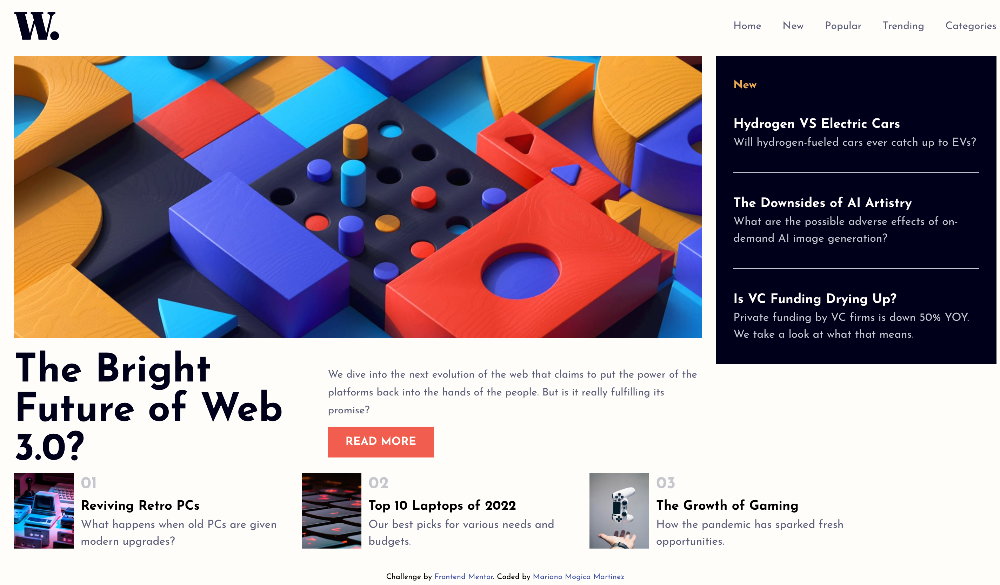
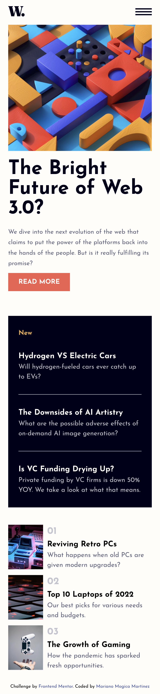

# Frontend Mentor - News homepage solution

This is a solution to the [News homepage challenge on Frontend Mentor](https://www.frontendmentor.io/challenges/news-homepage-H6SWTa1MFl). Frontend Mentor challenges help you improve your coding skills by building realistic projects.

## Table of contents

- [Overview](#overview)
  - [The challenge](#the-challenge)
  - [Screenshot](#screenshot)
  - [Links](#links)
- [My process](#my-process)
  - [Built with](#built-with)
  - [What I learned](#what-i-learned)
  - [Continued development](#continued-development)
  - [Useful resources](#useful-resources)
- [Author](#author)

**Note: Delete this note and update the table of contents based on what sections you keep.**

## Overview

### The challenge

Users should be able to:

- View the optimal layout for the interface depending on their device's screen size
- See hover and focus states for all interactive elements on the page

### Screenshot




### Links

- Solution URL: [GitHub Repository](https://github.com/Mariano7M/News-Homepage)
- Live Site URL: [GitHub page](https://mariano7m.github.io/News-Homepage/)

## My process

In order to complete this challenge I started creating the project by using Vite just with Vanilla JS, Then I adding the react and react-dom package to the project. Once I finished the project setup I started with the structure of the content in Html. After that I decided to export some of the elements in external components to keep everything more simple. With every component I was adding the style. I think having the elements on its own component lets the work to be more easy since you are only worried on the main goal of each component.

### Built with

- Semantic HTML5 markup
- CSS custom properties
- Flexbox
- Mobile-first workflow
- [React](https://reactjs.org/) - JS library

### What I learned

What I learned on this challenge was how to work with the React Framework. I already used another framewords like Angular and VueJS but I think this challenge really help me understand how React works.

Here is an example on how I implement a component:

```js
export default function AsideNews() {
	return (
		<section className='aside-news'>
			<h1 className='aside-news__title'>New</h1>
			<ul>
				{asideNews.map(asideNew => {
					return (
						<li key={asideNew.id} className='aside-news__item'>
							<h3 className='aside-news__item-title'>{asideNew.title}</h3>
							<p className='aside-news__item-content'>{asideNew.content}</p>
						</li>
					)
				})}
			</ul>
		</section>
	)
}
```

### Continued development

I think challenge really help with my learing on React but I still think I need to learn in more details other features of this React Framework like routing, state managament and probably more things.

### Useful resources

- [React - Quick Start](https://react.dev/learn) - This is an amazing article which helped me finally understand how the components in React actually works.
- [React - Importing and Exporting Components](https://react.dev/learn/importing-and-exporting-components) - This helped me on how to import react on existing project. I used vite to initialice with just vanilla JS so I added react plugin later.
- [Vite - Getting Started](https://vitejs.dev/guide/) - This is an amazing article which helped me understand how to create an enviroment for Javascript project.

## Author

- Frontend Mentor - [@Mariano7M](https://www.frontendmentor.io/profile/Mariano7M)
- Twitter - [@10MARINHO](https://twitter.com/10MARINHO)
